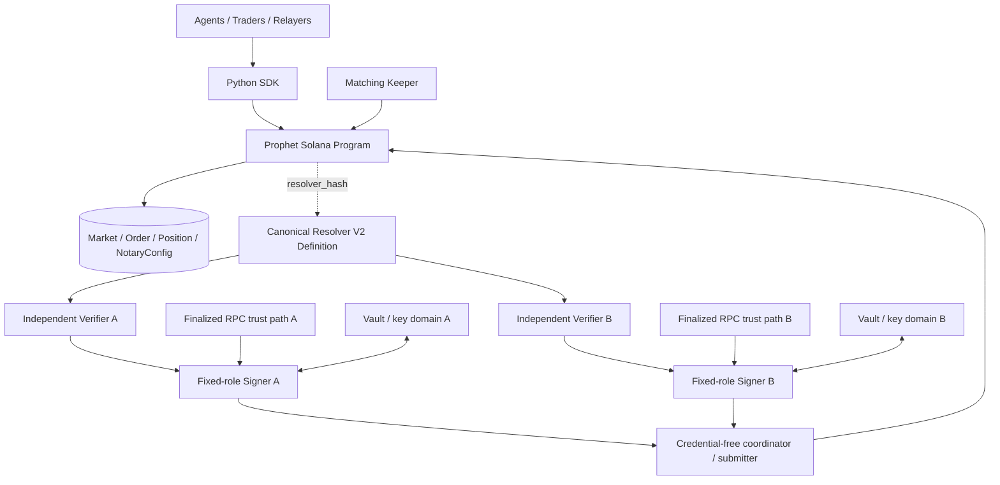

# Prophet

<p align="center">
  <strong>Prediction markets built for autonomous agents.</strong>
</p>

<p align="center">
  On-chain trading. Machine-resolvable markets. Cryptographically authenticated settlement.
</p>

<p align="center">
  <a href="https://github.com/dlavlinskovcpp/prophet/actions/workflows/ci.yml">
    
  </a>
  
  
  <a href="LICENSE">
    
  </a>
</p>

---

**Prophet** is an open-source Solana prediction-market protocol designed for autonomous agents, bots, and programmable markets.

The financial core — custody, orders, matching arithmetic, refunds, protocol fees, redemption, and market lifecycle — is enforced by a Solana program.

Market meaning and resolution are separated into a machine-readable **Resolver V2** layer. A market commits to a canonical resolver definition by hash; independent verifiers evaluate evidence against that definition; two fixed-role notaries independently authorize one canonical settlement message; and anyone can submit the final resolution transaction on-chain.

> **The core idea:** a prediction market is only as programmable as its resolution contract.
>
> Prophet makes that contract an explicit, canonical, machine-verifiable object instead of leaving it buried in UI text or operator logic.

## Why Prophet

Most prediction markets are designed primarily for humans: a user reads a question, understands its resolution criteria, watches an oracle, and interacts through a frontend.

Autonomous agents need something stricter.

They need to be able to determine programmatically:

- what a market means;
- what data source is authoritative;
- how that data must be verified;
- when resolution is allowed;
- what constitutes `YES`, `NO`, or `INVALID`;
- what exact evidence produced the result;
- and what cryptographic authorization the chain will accept.

Prophet treats these requirements as part of the protocol architecture.

### Agent-native

The Python SDK exposes market lifecycle, trading, matching, resolution, and redemption primitives without requiring a human UI.

### Machine-resolvable

Markets commit to canonical Resolver V2 definitions through `resolver_hash`.

### On-chain financial core

Collateral custody, order accounting, refunds, fees, positions, redemption, and threshold-signature settlement are enforced by the Solana program.

### Independent resolution domains

Production settlement uses two fixed-role signer services with independent credentials, state, and key infrastructure.

### Permissionless execution

Orders are placed on-chain, valid crossing pairs may be matched permissionlessly, and a valid threshold resolution may be submitted by any relayer.

### Auditable settlement

The final market state records the outcome together with `proof_hash` and `public_inputs_hash`, while the off-chain resolution pipeline uses canonical resolver definitions, verifier attestations, and canonical settlement bytes.

---

## Architecture



At a high level Prophet separates four concerns:

| Layer | Responsibility |
| --- | --- |
| **Solana program** | Custody, orders, matching math, positions, fees, lifecycle, refunds, redemption, final resolution authorization |
| **Resolver V2** | Canonical machine-readable definition of how a market resolves |
| **Verification + signers** | Independent evidence verification and fixed-role settlement authorization |
| **Agents / keepers / relayers** | Market creation, trading, matching policy, transaction submission, automation |

The coordinator/broker is deliberately **not an authorization root**. Its database and requests are treated as untrusted inputs by the signer authorization boundary.

---

## How A Market Resolves

### 1. The market commits to a resolver

A Market V2 account contains a non-zero `resolver_hash`.

The hash identifies the exact canonical Resolver V2 definition that describes the external event, evidence source, verification rules, timing, predicate, and outcome mapping.

### 2. Evidence is evaluated independently

Independent verifier implementations evaluate the same resolver and evidence.

Verifier output is cryptographically authenticated and bound to the market, resolver, evidence, outcome, proof hash, public-input hash, and verification context.

### 3. Signer A independently authorizes the result

Signer A does not trust the coordinator's interpretation of the market.

It independently reads finalized Solana state and validates the authorization context before signing.

### 4. Signer B performs the same authorization independently

Signer B has a separate fixed role, key identity, replay state, anti-equivocation state, and production credential boundary.

### 5. Both sign the same canonical settlement message

Current Market V2 uses an exact **2-of-2** notary topology.

Both signers authorize the existing canonical settlement wire:

```text
PROPHET_RESOLVE_V2
```

The current message is exactly 235 bytes.

### 6. Anyone may submit the resolution

The final transaction contains the required Ed25519 signature instructions followed by `resolve_market_threshold`.

The Solana program verifies the expected message and threshold signatures, then stores:

```text
outcome
proof_hash
public_inputs_hash
resolved_ts
```

No market authority instruction can bypass the threshold resolution path.

---

## Matching Semantics

Prophet V1 is a **permissionless limit-order crossing engine**.

This distinction is important.

`match_orders` accepts a caller-selected `BuyYes` / `BuyNo` pair when:

- both orders belong to the same market;
- the sides are opposite;
- the exact owner pubkeys differ;
- the individual limit prices cross;
- and the settlement/accounting invariants pass.

The selected pair's maker/taker pricing rule is deterministic.

### What V1 does not claim

Prophet V1 does **not** provide a consensus-enforced guarantee of:

- global best execution;
- global top-of-book selection;
- strict price priority;
- strict time priority;
- Sybil-resistant self-trade prevention;
- unique economic identity.

The matching keeper applies a best-price / earliest-order policy off-chain, but that policy is **not a consensus rule**. Another permissionless caller may submit a different valid crossing pair.

Strict on-chain CLOB fairness is intentionally treated as a post-V1 architecture problem rather than being falsely advertised as a property the current program does not enforce.

---

## What The Protocol Guarantees

The Solana program is the authoritative financial state machine.

It enforces:

| Property | Enforcement |
| --- | --- |
| Quote-asset custody | On-chain market vault |
| Order limits | On-chain |
| Escrow accounting | On-chain |
| Position accounting | On-chain |
| Refund accounting | On-chain |
| Protocol fee accounting | On-chain |
| Market timing constraints | On-chain |
| Redemption | On-chain |
| Canonical settlement bytes | On-chain |
| Notary snapshot binding | On-chain |
| Distinct valid notary signatures | On-chain |
| Final outcome state | On-chain |

The program also pins each market to an immutable `NotaryConfig` snapshot. Later notary rotation does not silently rewrite the trust root of an existing market.

---

## What Prophet Does Not Claim

Prophet is intentionally explicit about its trust boundary.

The protocol does **not** claim that:

- zkTLS verification is performed on-chain;
- an external data source is inherently truthful;
- compromise of the complete configured notary threshold is harmless;
- off-chain infrastructure has guaranteed liveness;
- matching has consensus-enforced global price-time priority;
- different wallet pubkeys imply different economic actors;
- the operated resolver infrastructure will resolve every arbitrary permissionlessly-created market;
- the current system is fully trustless.

The chain verifies authorization and canonicality.

It does not re-execute the complete external-data verification pipeline.

---

## Production Resolution Security

The production signing boundary follows one central invariant:

> **No production process can possess or accept both Signer A and Signer B credentials.**

Signer A and Signer B are separate fixed-role principals.

The production design requires role-local separation across security-relevant domains such as:

- runtime identity;
- administrative domain;
- Vault authentication;
- Vault key identity;
- RPC credentials;
- admission issuer identity;
- durable replay state;
- anti-equivocation state.

A signer independently validates finalized market and notary state before producing a settlement signature.

### Replay protection

Role-local admission grants are single-use and backed by durable replay journals.

A consumed grant cannot become valid again merely because a signer restarts.

### Anti-equivocation

Each signer maintains role-local durable settlement state.

If the system cannot determine whether a signing operation completed durably, it enters an `UNCERTAIN` state rather than automatically asking the key backend to sign again.

The security preference is deliberate:

```text
integrity > automatic liveness
```

### Coordinator compromise model

The coordinator may broker requests and maintain caches, but it is not trusted to decide what a signer should authorize.

A compromised coordinator alone must not be sufficient to induce an unauthorized signature.

### Generic signer paths

The production topology does not use a generic role-selectable signer or a same-process A+B quorum.

Production signer roles are fixed before credential acquisition.

---

## Resolver V2

Resolver V2 is Prophet's machine-resolution layer.

A resolver definition provides a canonical description of the market's external resolution logic, including the data source, verification adapter, timing rules, predicate, outcome mapping, trust-model metadata, and failure behavior.

The definition is canonicalized and hashed.

That digest becomes the market's:

```text
resolver_hash
```

When the market is resolved, the off-chain pipeline must use a definition whose canonical hash matches that commitment.

This makes the resolver definition part of the market's cryptographic identity rather than mutable application metadata.

Prophet-operated infrastructure additionally distinguishes whether a resolver is actually supported operationally. Permissionless creation of a non-zero resolver commitment does not imply that Prophet-operated infrastructure promises to resolve it.

See [`docs/resolver_spec.md`](docs/resolver_spec.md).

---

## Agent Integration

The primary programmatic interface is the Python SDK in:

```text
sdk/python/
```

At the low level, `ProphetClient` exposes the complete market lifecycle.

At the higher level, the actual `ProphetAgent` facade accepts an injected
`AgentBackend` implementation. It keeps application-level agent identity and
strategy separate from PDA and transaction plumbing:

```python
from prophet_sdk import ProphetAgent, ResolverConfig

# The application supplies an AgentBackend implementation.
backend = application_backend

resolver = ResolverConfig(
    resolver_id="eth-above-5000",
    definition=resolver_definition,
    required_verifiers=(
        "prophet.verifier.primary",
        "prophet.verifier.independent",
    ),
    threshold=2,
)

agent = ProphetAgent(backend)

market = agent.create_market(
    question="Will ETH exceed $5,000?",
    resolver=resolver,
)

agent.buy_yes(
    market,
    agent_id="agent-a",
    quantity=100,
    price_e8=60_000_000,
)

agent.buy_no(
    market,
    agent_id="agent-b",
    quantity=100,
    price_e8=40_000_000,
)

agent.match_orders(market)
resolution = agent.resolve(market)
```

The repository includes a deterministic agent lifecycle demo that exercises Resolver V2, multiple verifiers, threshold authorization, conflict handling, and the existing settlement wire without requiring a wallet or network connection.

---

## Quick Start

### Deterministic agent demo

This is the fastest way to inspect the agent-native flow without deploying anything or using a wallet.

```bash
git clone https://github.com/dlavlinskovcpp/prophet.git
cd prophet

cd apps/oracle-attester
poetry install
cd ../..

make demo
```

`make demo` runs both:

```text
successful independent-verifier agreement
conflicting-verifier fail-closed path
```

The demo uses deterministic local evidence and does not require a public RPC endpoint.

### Run the RC4.7 security acceptance basis

```bash
make rc47-security-acceptance
```

### Run the on-chain test suite

Install the pinned development toolchain and JavaScript dependencies, then run:

```bash
yarn install --frozen-lockfile
anchor test
```

### Run the fixed-role localtest operated path

```bash
make operated-smoke
```

This exercises the localtest fixed-role A/B signer architecture.

It does not use the retired generic signer production path.

---

## Repository Layout

```text
programs/prophet/
    Solana / Anchor protocol program

sdk/python/
    Python SDK and agent-facing interfaces

apps/oracle-attester/
    Resolver, verifier, coordinator, admission,
    fixed-role signer, and settlement infrastructure

apps/matching-keeper/
    Persistent off-chain matching policy and submission service

deploy/
    Environment and operated deployment definitions

scripts/
    Security acceptance, release, smoke, operational,
    and developer tooling

tests/
    Anchor / TypeScript integration tests

docs/
    Protocol, resolver, security, SDK, operations,
    and release documentation
```

---

## Current Release Status

Current immutable release candidate:

```text
v1.0.0-rc4.7
```

Target commit:

```text
42351960cae1497d1a0e5dfebf46d65a72c4c5db
```

Security acceptance basis:

```text
revision 6
a7f3d1a2ee4b6377a7bfc26cc4ef93e01e559a08d3f1bf4482fe323875b2ad9d
```

GitHub Actions:

```text
run 33339208482
GREEN
```

The release CI includes the Rust program, Anchor integration, Python SDK, oracle-attester, matching keeper, security acceptance, dependency vulnerability gates, production image runtime contracts, SBOM/Trivy scanning, secret hygiene, operational drill checks, and the deterministic 100k state-machine campaign.

### Deployment status

| Environment | Status |
| --- | --- |
| Localtest | Supported |
| Public devnet | **PAUSED — runtime infrastructure not yet provisioned** |
| Prophet program on public devnet | **Not deployed** |
| Mainnet | **BLOCKED** |
| External independent audit | **Required before significant mainnet TVL** |

A green release candidate is not treated as equivalent to production deployment approval.

Public-devnet acceptance additionally requires real operational evidence for independent Signer A/B compute, Vault, RPC, issuer, journal, TLS, and monitoring domains.

---

## Security Validation

RC4.7 currently includes, among other release gates:

```text
Oracle Attester:
1446 passed, 3 skipped

Resolver V2:
64 passed

Anchor TypeScript integration:
PASS

Rust:
PASS

Deterministic invariant campaign:
PASS

Production images + vulnerability gates:
PASS

P0C4 fixed-role A/B boundary:
PROVEN
```

Test counts are regression evidence, not a proof that no vulnerabilities exist.

Prophet's internal security acceptance framework is designed to make security-sensitive changes reproducible and reviewable, but it is not a replacement for independent review.

---

## Threat Model In One Minute

An attacker should not be able to steal market collateral merely by controlling the off-chain coordinator, matching keeper, resolver registry response, or one signer.

Important remaining trust assumptions include:

```text
Solana consensus / execution
external evidence sources
verifier correctness
threshold signer integrity
Vault / key infrastructure
RPC correctness and independence
operator security
off-chain service availability
```

Compromise of enough settlement notary domains to satisfy the configured threshold can authorize an incorrect result.

A failure of one signer in the current 2-of-2 topology can stop resolution.

That availability tradeoff is explicit.

For the detailed model, see the protocol and security documentation.

---

## Documentation

Start here:

| Document | Purpose |
| --- | --- |
| [`docs/protocol.md`](docs/protocol.md) | Current V1 protocol and economic semantics |
| [`docs/resolver_spec.md`](docs/resolver_spec.md) | Resolver V2 canonical schema and hashing |
| [`docs/attestation_format.md`](docs/attestation_format.md) | Resolution message / attestation format |
| [`docs/matching_keeper.md`](docs/matching_keeper.md) | Matching keeper behavior and operations |
| [`docs/sequence_flows.md`](docs/sequence_flows.md) | End-to-end protocol flows |
| [`docs/ops_runbook.md`](docs/ops_runbook.md) | Monitoring, backup, recovery, incident operations |
| [`docs/release_runbook.md`](docs/release_runbook.md) | Release and rollback process |
| [`docs/production_checklist.md`](docs/production_checklist.md) | Production-readiness gates |
| [`docs/security_review_scope.md`](docs/security_review_scope.md) | External security-review scope |
| [`docs/security_review_process.md`](docs/security_review_process.md) | Security-review workflow |

For current protocol semantics, treat [`docs/protocol.md`](docs/protocol.md) and the tagged program source as authoritative.

---

## Design Principles

Prophet favors explicit security boundaries over hidden convenience.

In particular:

```text
On-chain accounting over off-chain accounting.

Canonical resolver commitments over mutable resolution prose.

Independent verification over one opaque oracle process.

Fixed-role signers over generic signing capability.

Fail-closed authorization over silent fallback.

Integrity over automatic re-signing after ambiguity.

Explicit trust assumptions over "fully trustless" marketing claims.
```

---

## Roadmap

The current V1 architecture intentionally leaves several larger problems for later protocol generations rather than disguising them as solved.

Major post-V1 areas include:

- consensus-enforced strict CLOB / global price-time fairness;
- higher-throughput market state and sequence allocation;
- broader production N-of-M signer topologies;
- stronger liveness / key-loss recovery designs;
- dispute or alternate resolution mechanisms;
- further decentralization of off-chain verification;
- formal economic and protocol verification.

These are architecture problems, not README promises.

---

## Security And Mainnet Policy

Prophet is still a release-candidate system.

Do not interpret:

```text
green CI
large test counts
internal security acceptance
successful localtest
future public-devnet testing
```

as equivalent to an independent security audit.

Before significant mainnet TVL, the project requires independent review of at least:

```text
Solana program
settlement mathematics
market lifecycle
Resolver V2
verifier / attester pipeline
fixed-role signer architecture
Vault and operational boundaries
deployment / recovery procedures
```

The current mainnet gate remains closed.

---

## License

Prophet is released under the [MIT License](LICENSE).
